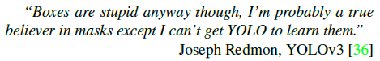
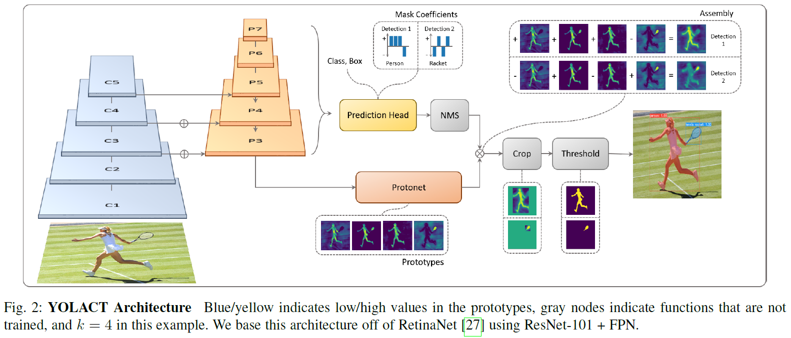
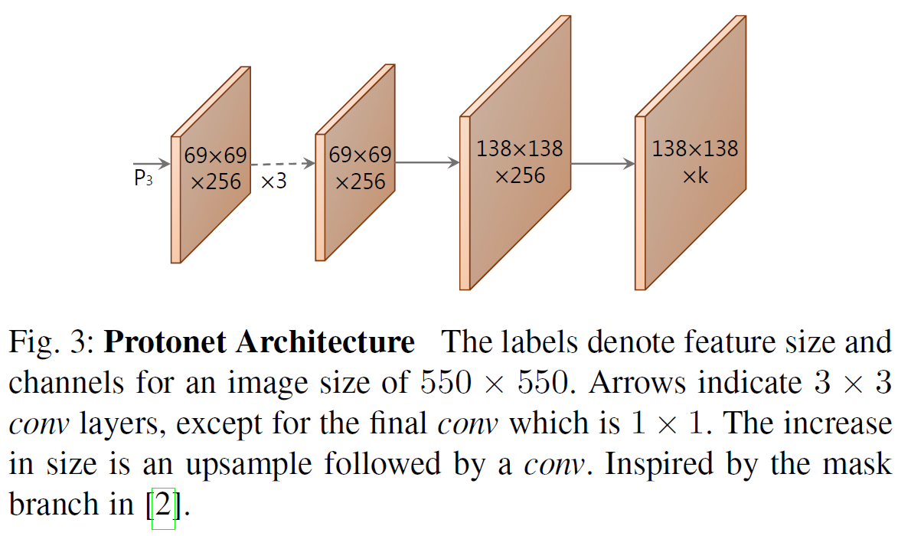
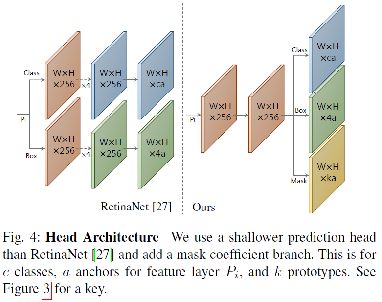
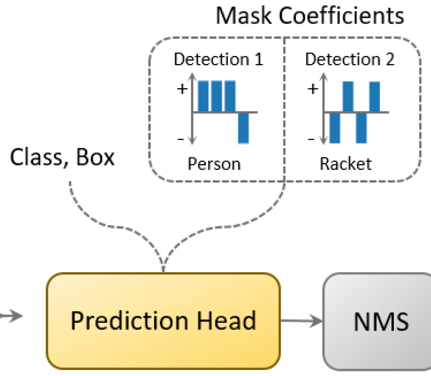
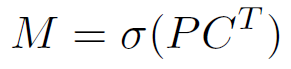
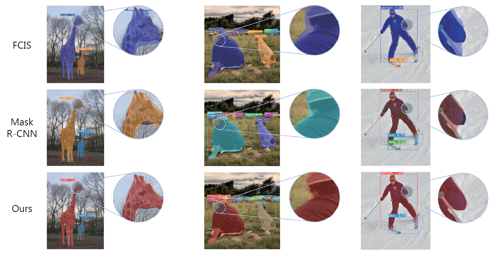

# YOLACT++: Better Real-time Instance Segmentation

[https://github.com/dbolya/yolact](https://github.com/dbolya/yolact)

> 
이건 anchor free나 bbox free도 아니라고 생각함. 그저 새로운 개념의 instance segmentation.

* 기존 one-stage detector에 새로운 head를 붙인 것이기 때문에 anchor가 있을 수도 없을 수도 있음. 여기에서는 RetinaNet을 이용하는데 이것도 마찬가지로 anchor가 있는 one-stage 알고리즘임. RetinaNet은 Cross entropy loss를 하지 않고 focal loss를 썼다는 차이만 있을 뿐임.
* bbox를 찾고 나서 그 안에서 masking을 하는 것은 아니기때문에 bbox에 종속된 segmentation은 아님.
* 아래 두가지 페이퍼를 참고하였음. 
  * ICCV: YOLACT: Real-Time Instance Segmentation
  * TPAMI: YOLACT++: Better Real-time Instance Segmentation

### YOLACT demo video

<iframe width="560" height="315" src="https://www.youtube.com/embed/0pMfmo8qfpQ" title="YouTube video player" frameborder="0" allow="accelerometer; autoplay; clipboard-write; encrypted-media; gyroscope; picture-in-picture" allowfullscreen></iframe>

## Introduction
    
**Y**ou **O**nly **L**ook **A**t **C**oefficien**T**s

YOLO 저자의 말처럼 박스를 생성한다는 것 자체가 굉장히 바보같은 일이며 마스크가 물체 인식에 있어서 결국에는 옳은 방법일 것이다. 즉 Instance segmentation을 박스없이 해낼 수 있다면 가장 좋은 방법일 것이다.

이 논문의 저자는 Instance segmentation을 real-time으로 수행하길 원한다. 하지만 **Instance segmentation은 문제 자체가 detection보다 매우 어렵기 때문에** SSD나 YOLO가 그랬던거 처럼 원래 two-stage였던 알고리즘을 단순히 one-stage로 변경하기는 쉽지 않다. 그리고 two-stage에서 비롯된 RoI를 순차적으로 segmentation해야 하기 때문에 속도를 올리기에는 어려움이 있다. 이러한 기존 방식들은 **feature localization**에 매우 큰 공을 들이고 있다. 즉 RoI pooling이나 RoI align등과 같은 방식으로 생성하는 feature를 말한다. 물론 그것을 병렬로 수행한 FCIS가 있지만 이 경우 후처리에 계산 비중에 크기 때문에 real-time과는 거리가 있다.

                          

이러한 이슈들로 인해 YOLACT는 localization step을 생략하고 두가지의 task를 병렬로 수행한다. 
1. **전체 이미지에 대한 non-local prototype mask의 dictionary를 생성**
2. **각 Instance가 가지는 선형적인 조합 상관계수(combination coefficient)를 예측**

**위와 같은 방식을 이용해서 시각적, 공간적, 의미적으로 비슷한 물체가 서로 다른 protype으로 어떻게 나타나는지 보여준다.**
                         
 

이러한 방식이 가진 장점이 있는데,     
1. 빠른 속도: 병렬구조로 매우 경량화된 프로세스들로 구성되어있기때문이다. ResNet-101을 사용하고도 30fps를 달성한다.
2. 마스크 퀄리티: repooling으로 손실되는 것없이 전체 영역의 이미지를 사용하기 때문에 다른 방식보다 훨씬 높은 퀄리티를 가질 수 있다.
3. 일반성(호환성): 거의 모든 최신 object detector에 붙여서 사용할 수 있다.

결론적으로  "**YOLACT는 빠르고 정교하고 호환성이 좋다**" 라고 정리할 수 있다.

Main contribution은 instance segmentation 알고리즘 중 **첫번째 real-time 알고리즘**이라는 것이다.(2019년 4월 기준)
    

## Method
    
저자들의 목표는 **"존재하는 one-stage object detection 알고리즘에 feature localization step을 제거하고 mask branch를 붙이는 것이다."**

### Prototype Generation

{: width="50%" height="50%"}
  
k개의 prototype mask를 생성하기 위해 FCN방식으로 구성했다.
  
2가지의 중요한 요소로는
  
1. Small object에 대한 성능을 더 좋게 하기 위해 FPN을 적용해서 제일 deep하고 high resolution인 featrue를 사용했고 인풋 이미지의 1/4크기로 업샘플링했다.
2. protonet의 output, 즉, prototype은 가질 수 있는 값이 한정되어 있지 않기 때문에 해석의 용이성을 위해 ReLU를 선택적으로 쓸 수 있도록 했다. 논문은 ReLU를 적용한 버전이다.

(왜 이렇게 일반적인 내용을 중요 요소 2가지라고 논문에 써놓은거냐..)

  
### Mask Coefficients

{: width="500"}
  
4개의 bounding box 값과 class 확률 c, k개의 coefficient이 필요하기 떄문에 총 (4 + c + k)개의 값을 예측한다. (anchor 당) → anchor 갯수 a로 인해 결국 grid당 (4 + c + k) * a개의 값 예측(Fig. 4)
  
### Mask Assembly
  
Prototype mask도 생성했고 각 anchor의 coefficient도 생성했다면 이제 조합할 차례다.

  
P: (h x w x k) prototype mask
  
C: (n x k) coefficients
  
위와 같이 아주 단순한 선형식으로 조합하고 sigmoid를 취해 최종 마스크를 생성해낸다.

### Losses
  
3개의 loss를 사용
  
1. Classification loss: YOLO랑 같은 방식(즉, 일반적인)
2. Box regression loss: YOLO랑 같은 방식(즉, 일반적인)
3. Mask loss: BCE (역시나 일반적인)

(loss 구성에는 노력을 들이지는 않았고 전체적인 아이디어에 치중했음)
  
### Cropping Masks
  
Evalution때는 예측된 bbox로 제한하여 mask를 crop하였고, 학습 때는 GT Box의 도움을 받아 cropping했음.

(굳이 cropping한거 보면.. mask에 노이즈가 많은듯..? 결국 box에 종속되는 것 같은데...)
    
## Result

{: width="2000"}
    
(진짜 이정도로 좋아질까?)
    

## 총평

매우 신박한 아이디어의 새로운 instance segmentation이다. 신선한 발상에 연구적으로 좋은 논문이라고 생각한다. 또한 bounding box에 종속되지 않고 masking을 할 수 있다는 희망을 준 논문이었다. 하지만 결국 완전한 독립을 구현했는지는 의문이고 실험의 수치적 AP와 인식된 결과 이미지의 성능이 약간은 상반되는 것 같아 의문점이 남아있다.(Mask RCNN보다 AP 성능이 낮다고 되어있는데 이미지결과는 더 좋음)
